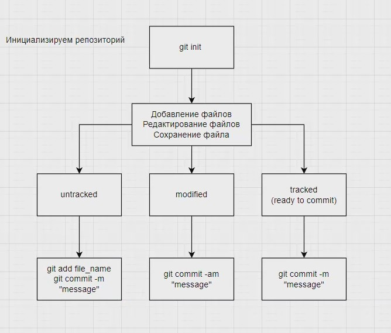

# Инструкция по работе с git

## Команды

*список*

>**git init** - Инициализация репозитория.
>
>**git status** - Статус файлов.
>
>**git add** - Добавить версионность файла.
>
>**git commit** - Зафиксировать изменения.
>
>**git log** - История изменений.
>
>**git commit --amend -m "message"** - Отредактировать >последнее сообщение коммита.
>
>**git commit -m "message"** - Закоммитить изменения с сообщением.
>
>**git checkout** - Перемещение по коммитам.
>
>**git diff** - Сравнить изменения с последним коммитом.
>
Ссылка на ресурс(https://github.com/cyberspacedk/Git-commands)

Состояние файлов:

Команды для работы с ветками:

>**git branch** - список всех веток.
>
>**git merge** - слияние двух веток.
>
>**git checkout branch** - переход на ветку.
>
>**git branch -d branch_name** - удаление ветки.
>
>**git checkout -b branch_name** - создать ветку и сразу же в нее перейти.

# Создание и решение конфликтов:

1.Конфликт возникакет, когда один и тот же текст в разных ветках написан по разному.

2.При слиянии веток появляются все версии текста.

3.Решается, что требуется в итоге.

4.Это решение отправляется GIT через выбор функций, которые выводит GIT(их 4).

Работа с удаленными репозиториями.

>**GitHub** - сервис компании Майкрософт для организации работы удаленных репозиториев

>**git clone** - копирует внешний репозиторий на локальный ПК.

>**git pull** - скачивает все из текущего репозитория и автоматически делает merge с нашей версией.

>**git push** - отправляет свою версию репозитория во внешний репозиторий.

>**fork** - создание ответвления(вилки) репозитория.

>**pull request** - команда для предложения изменений, запрос на вливание изменений в репозиторий.
